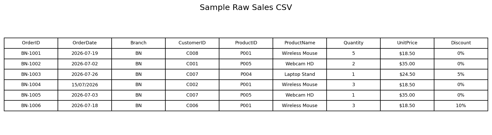
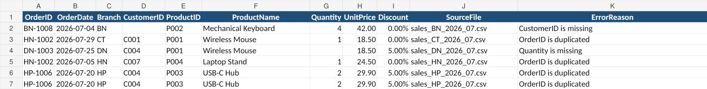
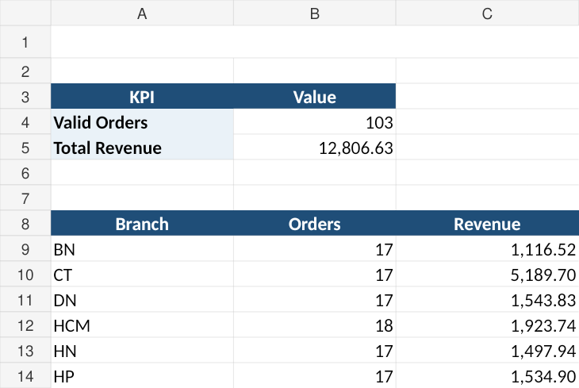

# Sales Data Cleaning & Excel Report Automation

> **Portfolio Project – Simulated Client Requirement**

A reusable Python automation that processes monthly sales CSV files from multiple branches, cleans and validates the data, calculates revenue, and generates a consolidated Excel report.

## Client Problem

Monthly sales files arrive from several branches with inconsistent formats and occasional data-quality problems. Manually combining and checking them is repetitive and error-prone.

## Solution

The Python script automatically:

- reads every CSV file in the input folder
- combines branch data into one dataset
- standardizes supported date formats
- cleans text, quantity, price, and discount values
- detects missing values and duplicate OrderIDs
- separates valid and invalid records
- calculates order revenue
- creates an Excel report with summary metrics

## Workflow

```text
CSV Files
    |
    v
Combine Data
    |
    v
Clean & Normalize
    |
    v
Validate Records
   / \
  v   v
Valid Errors
  |
  v
Revenue Calculation
  |
  v
Excel Report
```

## Sample Result

The included sample dataset contains **109 input records**.

- **103 valid orders**
- **6 error records**
- **Total valid revenue: 12,806.63**

The Excel output contains:

- `Clean_Data` – cleaned valid transactions
- `Errors` – rejected records with an explicit error reason
- `Summary` – total valid orders, total revenue, and branch-level totals

## Screenshots

### Sample Input


### Validation Errors


### Final Summary


## Project Structure

```text
project-01-sales-data-automation/
├── README.md
├── customer_requirements.txt
├── main.py
├── requirements.txt
├── sample_input/
├── sample_output/
│   └── Sales_Report.xlsx
└── screenshots/
    ├── 01_input_data.png
    ├── 02_errors.png
    └── 03_summary.png
```

## Business Rules

- Required fields must not be blank.
- `OrderID` must be unique.
- `Quantity` must be an integer greater than 0.
- `UnitPrice` must be numeric and greater than 0.
- `Discount` must be between 0 and 1.
- Supported dates: `YYYY-MM-DD`, `DD/MM/YYYY`, `YYYY/MM/DD`.
- Duplicate OrderIDs are sent to `Errors`; the program does not guess which duplicate is correct.

## Revenue Formula

```text
Revenue = Quantity × UnitPrice × (1 - Discount)
```

## Technologies

- Python
- pandas
- openpyxl
- Excel / CSV

## Run Locally

```bash
pip install -r requirements.txt
python main.py
```

For a new month, place the new CSV files in an `input` folder and run the script again.

## Portfolio Note

All data in this repository is synthetic and created specifically for demonstration. No real client or confidential business data is included.
