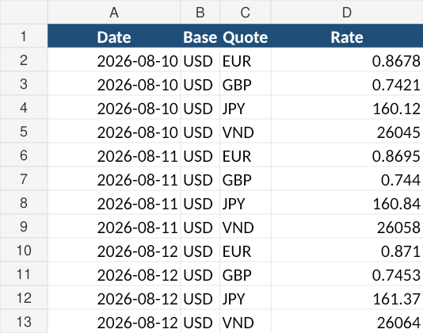
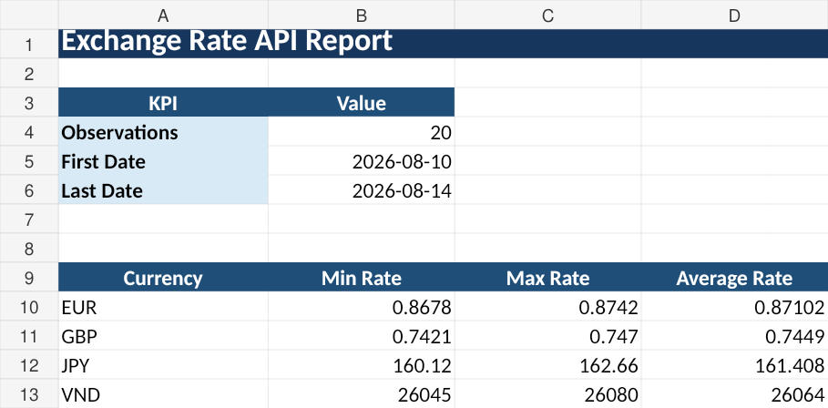
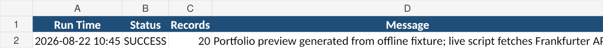

# Exchange Rate API Automation

> **Portfolio Project – Simulated Client Requirement**

A Python automation project that retrieves historical exchange-rate data from a REST API, validates the response, and produces CSV and Excel reports.

## Business Problem
A client repeatedly checks exchange-rate data and copies it into spreadsheets. This project replaces that manual workflow with a reusable script.

## Solution
- REST API request with configurable base currency, quotes and date range
- timeout / connection / HTTP / JSON error handling
- response validation
- JSON-to-tabular transformation
- CSV export
- Excel report with `Rates`, `Summary`, and `Run_Log`

## Workflow
```text
REST API -> HTTP Request -> JSON -> Validate/Transform -> CSV + Excel Report
```

## Technologies
Python, requests, REST API, JSON, pandas, openpyxl, CSV, Excel

## API
Frankfurter v2: `https://api.frankfurter.dev/v2/rates`
No API key is required.

## Screenshots
### Rates

### Summary

### Run Log


## Run
```bash
pip install -r requirements.txt
python main.py
```

## Reuse
Edit these values in `main.py`:
```python
BASE = "USD"
QUOTES = ["EUR", "GBP", "JPY", "VND"]
DATE_FROM = "2026-08-01"
DATE_TO = "2026-08-15"
```

## Portfolio Note
The sample workbook is generated from an offline fixture so the repository always contains a stable preview. The actual `main.py` fetches live data from the Frankfurter API at runtime. No confidential client data is included.
