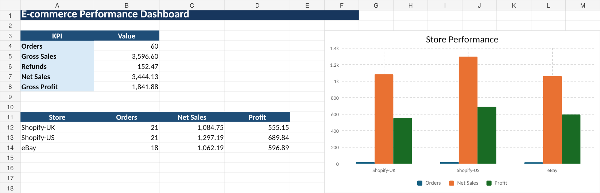
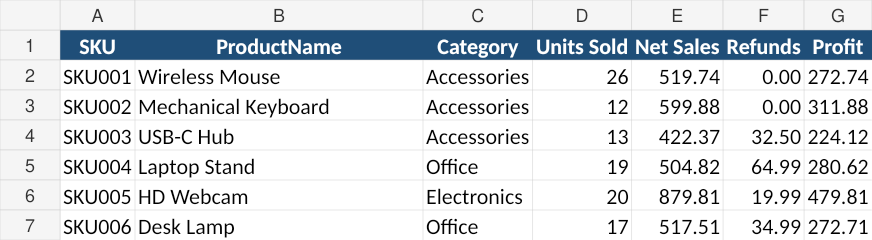
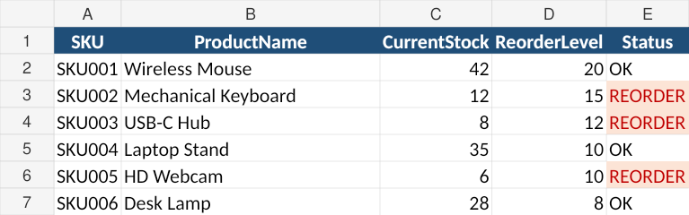

# E-commerce Reporting Automation

> **Portfolio Project – Simulated Client Requirement**

A Python reporting workflow that combines order, product-cost, refund, and inventory data into one management Excel report.

## Business Problem

E-commerce teams often export data from several systems and manually combine it in Excel. This project automates that recurring reporting workflow.

## Inputs

- `orders.csv` – order transactions from multiple stores
- `products.csv` – product master, unit cost, and inventory
- `refunds.csv` – refunds linked to order IDs

## Solution

The automation:

- validates the three input files
- joins order and product data by SKU
- matches refunds to orders
- calculates Gross Sales, Net Sales, COGS, and Profit
- summarizes performance by product and store
- identifies low-stock products
- creates one Excel management report

## Workflow

```text
Orders.csv -------+
                  |
Products.csv -----+--> Validate --> Join / Transform --> KPIs --> Excel Dashboard
                  |
Refunds.csv ------+
                                      |
                                      +--> Inventory Alerts
```

## Output Workbook

### Dashboard
Management KPIs and store performance.

### Orders_Enriched
Order-level data with product details, refunds, COGS, and profit.

### Product_Performance
Units sold, net sales, refunds, and profit by SKU.

### Inventory_Alerts
Products at or below their reorder level.

### Run_Log
Execution status and record count.

## Screenshots

### Dashboard


### Product Performance


### Inventory Alerts


## Technologies

- Python
- pandas
- Excel / CSV
- openpyxl
- data joins
- business KPI calculation
- reporting automation

## Run

```bash
pip install -r requirements.txt
python main.py
```

For a new reporting cycle, replace the CSV files in the `input/` folder and run the script again.

## Portfolio Note

All input data in this repository is synthetic. This project is designed to demonstrate a workflow similar to real freelance e-commerce reporting and spreadsheet automation jobs.
